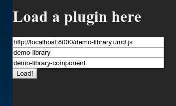

# ngx-golden-layout-dynamic-library

This library demonstrates the build process and the lazy loading of dynamic libraries using ngx-golden-layout and angular ivy.
To get you started building an own library:

- Create a new library using `ng g lib YOUR_LIBNAME` (memorize the library name, it is important)
- If not done, install dependencies: `npm i -D ngx-golden-layout jquery golden-layout @types/jquery`
- Change `tsconfig.lib.json` in your module directory to state `enableIvy: true` under `angularCompilerOptions`
- Change `tsconfig.lib.json` in your module directory to state `jquery` under `types`
- Create your library, declare your components in your libraries main module using `forChild` (see example in `projects/demo-library/src/lib/demo-library.module.ts`)
- Run `ng build YOUR_LIBNAME`

After that, you should end up with a ready-to-use library which you can load in ngx-golden-layout.
To test it here, run
- `npm ci`
- `ng build demo-library`
- `cd dist/demo-library/bundles`
- `ls`, to get the filename
- run an http server (e.g. `python -m http.server`)

When you're running the ngx-golden-layout-electron project, you might serve the demo library as follows:

